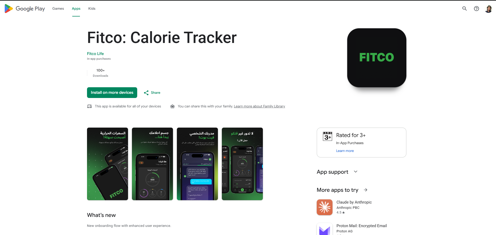
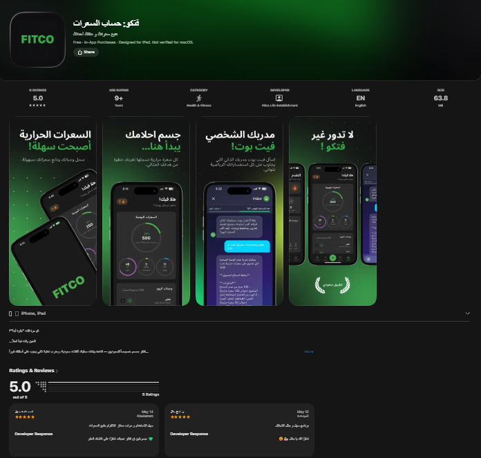
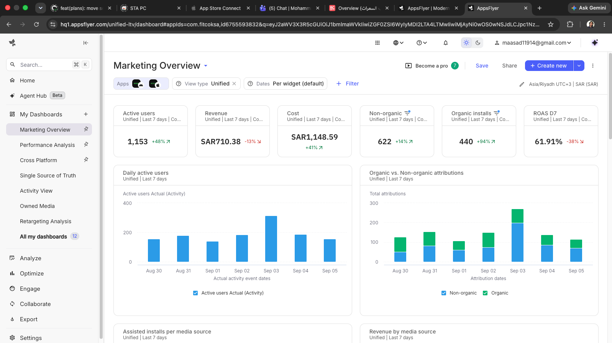

# Fitco: Calorie Tracker 🥗

> A modern, bilingual (Arabic & English) health and nutrition mobile app designed to help users take full control of their daily nutrition, calculate calories, track macronutrients, and achieve their fitness and wellness goals.

[](https://play.google.com/store/apps/details?id=com.fitcoksa)
[](https://apps.apple.com/us/app/%D9%81%D8%AA%D9%83%D9%88-%D8%AD%D8%B3%D8%A7%D8%A8-%D8%A7%D9%84%D8%B3%D8%B9%D8%B1%D8%A7%D8%AA/id6755593832)

---

## 🔗 Live Downloads

- **Google Play Store (Android):** [Download on Google Play](https://play.google.com/store/apps/details?id=com.fitcoksa)
- **Apple App Store (iOS):** [Download on the App Store](https://apps.apple.com/us/app/%D9%81%D8%AA%D9%83%D9%88-%D8%AD%D8%B3%D8%A7%D8%A8-%D8%A7%D9%84%D8%B3%D8%B9%D8%B1%D8%A7%D8%AA/id6755593832)

---

## 📸 App Showcase

> *"I didn't just build this app. I launched a successful, scalable business for my client."*

Fitco is live in production across the globe, actively serving thousands of users with high ratings and strong marketing performance:

| Google Play Store | Apple App Store | AppsFlyer Attribution |
| :---: | :---: | :---: |
|  |  |  |

---

## 🛠️ Tech Stack & Key Learnings

Building Fitco involved integrating industry-standard mobile infrastructure for performance, revenue, and growth:

1. **Expo & React Native (iOS & Android)**
   - Architected a unified cross-platform mobile experience using **Expo SDK 54** and **React Native 0.81**.
   - Implemented typed, file-based routing via **Expo Router**, native performance animations via **Reanimated**, and full RTL support for native Arabic typography.

2. **RevenueCat (Subscription & Monetization Management)**
   - Integrated **RevenueCat (`react-native-purchases`)** for robust cross-platform in-app subscriptions, product entitlement verification, receipt validation, and recurring billing management.

3. **Superwall (Dynamic Paywalls & Onboarding)**
   - Integrated **Superwall (`expo-superwall`)** to deploy, test, and remotely iterate paywalls and interactive onboarding flows on the fly without waiting for App Store/Play Store review cycles.

4. **AppsFlyer (Attribution & Campaign Management)**
   - Integrated **AppsFlyer (`react-native-appsflyer`)** for deep-link tracking, campaign attribution, ad-spend optimization, ROAS calculation, and user acquisition lifecycle analysis.

---

## ✨ Core Features

- **Daily Calorie & Macro Tracking:** Real-time calorie budgeting tailored to user body metrics, target weight, and activity level with dynamic breakdown of proteins, fats, and carbs.
- **Barcode Scanner & Food Logging:** Camera-powered instant barcode scanner (`expo-camera`) and search to log meals, ingredients, and nutritional data effortlessly.
- **Comprehensive Food Journal:** Organize and review daily food entries categorized by breakfast, lunch, dinner, and snacks.
- **Insights & Progress Analytics:** Visual charts and trends tracking daily nutritional habits, weight progression, and macronutrient balance over time.
- **Full Localization & RTL:** Designed natively for the MENA region with complete Arabic and English support, including automatic layout mirroring.
- **Seamless Social Authentication:** Quick, secure authentication with **Apple Sign-In** and **Google Sign-In** backed by Firebase.
- **Engagement & Notifications:** Automated smart meal and trial reminders using `expo-notifications`.

---

## 💻 Running the Project Locally

### Prerequisites
- **Node.js:** v18 or v20+ recommended
- **Java Development Kit (JDK):** JDK 17 recommended (for Android build)
- **Android Studio & Android SDK:** Configured with `ANDROID_HOME` (for Android build)
- **Xcode & CocoaPods:** macOS only (for iOS build)
- **Package Manager:** npm or yarn

### Installation & Execution

1. **Clone the repository:**
   ```bash
   git clone https://github.com/mohammad-al-asad/FitnessApp.git
   cd FitnessApp
   ```

2. **Install dependencies:**
   ```bash
   npm install
   ```

3. **Configure Environment Variables:**
   Create a `.env` file in the root directory and populate your keys:
   ```env
   EXPO_PUBLIC_SERVER_URL=https://your-api-domain.com
   EXPO_PUBLIC_REVENUECAT_APPLE_KEY=your_revenuecat_apple_key
   EXPO_PUBLIC_REVENUECAT_GOOGLE_KEY=your_revenuecat_google_key
   EXPO_PUBLIC_SUPERWALL_IOS_PUBLIC_API_KEY=your_superwall_ios_key
   EXPO_PUBLIC_SUPERWALL_ANDROID_PUBLIC_API_KEY=your_superwall_android_key
   EXPO_PUBLIC_APPSFLYER_DEV_KEY=your_appsflyer_dev_key
   EXPO_PUBLIC_APPSFLYER_APP_ID=your_appsflyer_app_id
   ```

4. **Run on Android:**
   ```bash
   npx expo run:android
   ```

5. **Run on iOS (macOS only):**
   ```bash
   npx expo run:ios
   ```
